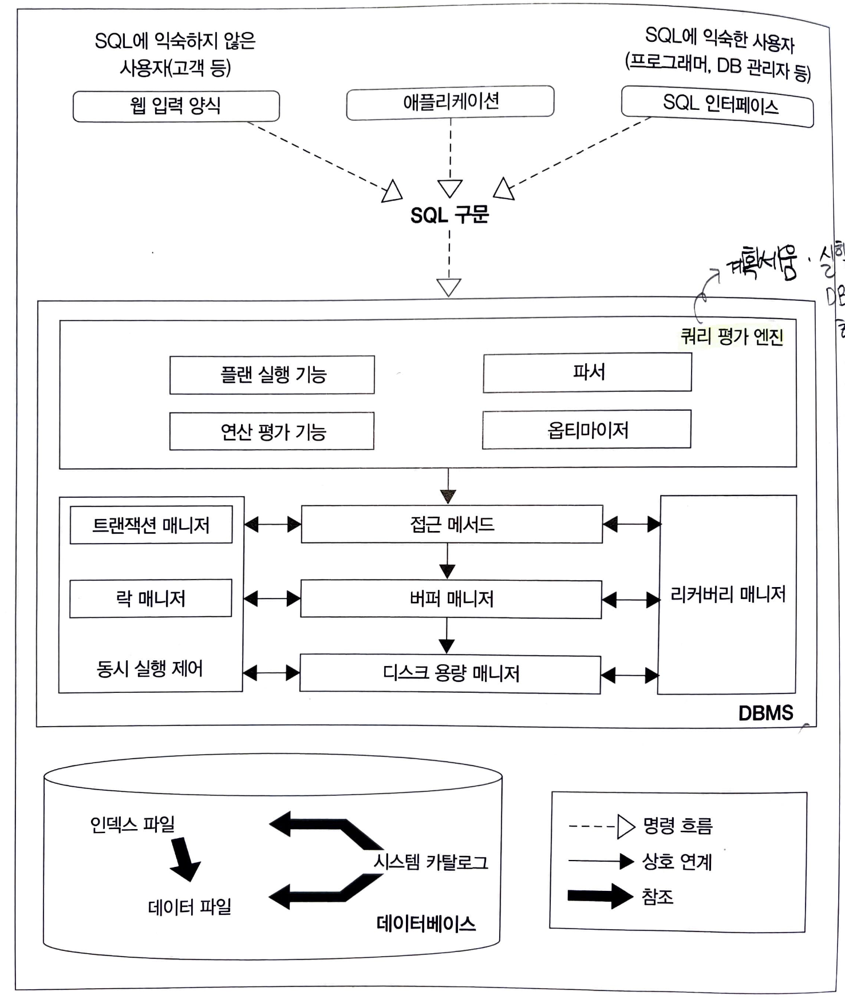

# 디비 아키텍처

---

- 현재 rdb 제품은 oracle, h2, mysql, mssql, postgresql 등 다양하게 있다. 
- 각각의 제품마다 디비 아키텍처의 차이점이 있다. 
- 많은 제품 중에서 mysql의 아키텍처에 대해서 정리를 하겠다.

## mysql 아키텍처

 
 
### 1. 쿼리 평가 엔진
- 입력받은 sql을 분석하고 어떤 순서로 기억장치의 데이터에 접근할지 결정한다. -> 순서는 실행 계획이 정한다.

```sql
접근 메서드
- 실행 계획에 기반을 둬서 데이터에 접근하는 방법
```

> sql 쿼리구문을 받아 실행계획을 수립하는 역할을 한다.

### 2. 버퍼 매니저
- 디비에서 사용하는 버퍼를 메모리 영역에 관리하는 것
- 디스크 용량 매니저와 함께 연동하여 작동한다.

### 3. 디스크 용량 매니저
- 디비를 사용하면서 데이터를 적재하면 데이터를 영구적으로 저장을 해야된다. 이때 디스크 매니저는 어디에 어떻게 저장할지 관리하여
효율적으로 디비를 사용할 수 있도록 만들어준다.

