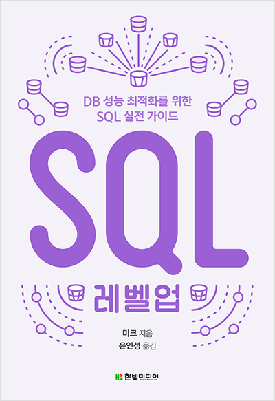

# SQL 레벨업

---

## 목차
---
- [DBMS 아키텍처](/SQL%20레벨업/DBMS%20아키텍처.md)
- [SQL 기초](/SQL%20레벨업/Select구문.md)
- [SQL 조건 분기]()
- [집약과 자르기]()
- [반복문]()
- [결합]()
- [서브쿼리]()
- [SQL 순서]()
- [갱신과 데이터 모델]()
- [인덱스 사용]()