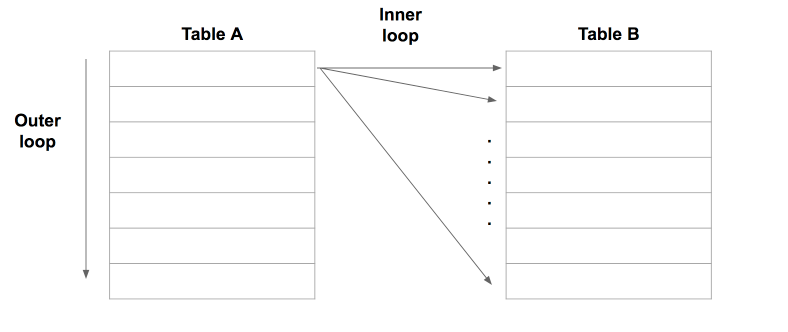
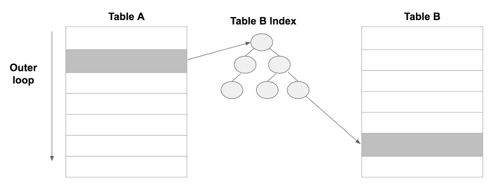

# 6장 결합

---

# 정리
```
1. mysql의 조인 알고리즘은 nested loop만 지원한 .
2. nested loop에서 가장 중요한 부분은 Row가 적은 Driving Table + Inner Table의 조인키에는 인덱스

```


## 기능적 관점으로 구분하는 결합의 종류


### 1. 크로스 결합
- 크로스 조인은 실무에서 사용하는 경우는 겨의 없다. 왜냐하면이러한 결과가 필요한 경우가 없고 비용이 많이 들기 때문에 성능에 문제가 발생할 수 있다.
- 크로스 조인은 카디널리곱이라고 불린다. 모든 컬럼을 곱하는 형태가 나온다. 아래의 2개의 테이블의 컬럼은 모든 경우의 수를 가질 수 있다.


```sql
select *
    from employ
     cross join
    department;
```

**실수로 사용한 크로스 결합**

```sql
select *
    from emply, department
```
- 위와 같은 쿼리를 사용하면 크로스 조인을 한다. 이런 코드는 결합 조건을 지정하지 않고 사용하기 때문이다.
- inner join과 같은 표준 sql같은 경우에는 결합 조건이 없다면 구문 오류가 발생한다.

### 2. 내부 결합
- 내부 결합은 가장 많이 사용되는 방법이다. 위에 쿼리를 보면 사원 테이블만으로는 사원의 부서 이름을 알 수 없다. 이를 알기 위해서는 부서 테이블에 접근해야 된다.
- 이때 결합 키를 이용하여 양쪽 테이블 모두에 존재하는 부서 필드를 사용하여 필드를 가져와야 한다.

```sql
select 
    e.emp_id, e.emp_name, e.dept_id, d.dept_name
from employ e
    inner join department d
on e.dept_id = d.dept_id;
```


- 내부 결합과 같은 기능을 하는 상관 서브쿼리
- 내부 결합은 기능적으로 상관 서브쿼리를 사용해 대체 가능한 경우가 많다.

> 스칼라 서브쿼리
```sql
select e.emp_id, e.emp_name, e.dept_id
(select d.dept_name
    from department d
    where e.dept_id = d.dept_id) as dept_name
from employ e;
```

- 위의 두 쿼리는 같은 기능을 하지만 우리는 좋은 방식을 선택해야된다. 스칼라 서브쿼리로 사용하면 결과 레코드 수만큼 서브쿼리를 실행을 해야되기 때문에 비용이 높아진다.

### 외부 결합
- 외부 결합은 내부 결합과 자주 사용되는 결합이다.  일반적으로 카르트 곱의 부분 집합이 아니지만 경우에 따라서 데카르트 곱의 부분 집합이 되기도 한다.
- 종류로는 왼쪽 , 오른쪽, 완전 외부 결합을 할 수 있다.

- 이때 우리는 왼쪽, 오른쪽을 선택하는 기준은 레코드의 수를 기반으로 선택을 합니다.


```sql
SELECT <열 목록>
FROM <첫 번째 테이블(LEFT 테이블)>
    <LEFT | RIGHT | FULL> OUTER JOIN <두 번째 테이블(RIGHT 테이블)>
     ON <조인 조건>
[WHERE 검색 조건]
```


### 자기 결합
- 자기 자신과 결합하는 연산을 의미한다. 간단하게 말하면 같은 테이블 -> 즉 뷰를 사용해 결합하는 것이다.
- 자기 결합 + 크로스 조합
```sql
SELECT <열 목록>
FROM <테이블> 별칭A
    INNER JOIN <테이블> 별칭B
    [WHERE 검색 조건]
```


## 결합 알고리즘과 성능
- 결합에 있어서 크게 3가지의 결합 알고리즘이 있다.
1. nested loops
2. hash
3. sort merge
- 실행계획을 해봤으면 많이 보았을거다. 가장 많이 사용하는 알고리즘은 nested loops이고 다음은 hash -> sorted merge이다.
- 대부분 위에 3가지 알고리즘은 관계형 데이터베이스에서 지원을 한다. 하지만 mysql처럼 nested loops와 그 파생 버전만 지원하고 hash, sort merge를 사용하지 않는 디비도 있다.


### 1. Nested Loops
- Nested Loops는 **중첩 반복을 사용하는 알고리즘이다.** SQL에서 결합은 한 번에 두 개의 테이블만 결합하므로 본질적으로 이중 반복과 같은 의미를 가진다.

- 

> 세부적인 처리 과정
1. table a에서 row를 하나씩 반복하면 스캔한다. ( table a는 driving table 혹은 outer table이라고 불린다. table b는 inner table이라고 한다.)
2. outer table의 row 하나마다 inner table 레코드를 하나씩 스캔해서 join 조건이 맞으면 리턴한다.
3. 1~2를 통해 outer table의 모든 row에 반복한다.

- 이것을 보면 nested loops의 실행시간은 다음과 같다.
```
  Table A의 결과 Row * Table B의 결과 Row = Nested Loop의 실행 시간
  => R(A) * R(B) = 실행시간
  = R(B) * R(A)  
```

- 이를 살펴보면 `R(B) * R(A)`의 시간이 나온다. 그런데 `outer table은 작은걸 선택해야 성능이 좋아진다`는 이야기를 듣는다.
- 하지만 결국 시간은 똑같은데 왜 이럴까를 생각해보면 `inner table의 조인 키는 인덱스가 있어야한다.`이게 필수로 있어야 한다.



> Row가 적은 Driving Table + Inner Table의 조인키에는 인덱스


- nested loop 단점
인덱스 조합으로 왠만한 성능은 해결할 수 있다. 하지만 결합 키로 내부 테이블을 너무 많은 데이터가 있으면 성능적인 문제가 발생할 수 있다.
예를 들어서 점포 (driving) , 주문(inner)이면 수많은 데이터를 접근을 해야된다.


### Hash

- 동작방식
작은 테이블을 스캔하고 결합 키에 해시 함수를 적용해서 해시값으로 변환 -> 이후 큰 테이블을 스캔해서 결합 키가 해시값이 존재하는 지 확인한다.
이때 작은 테이블에 해시 테이블을 만드는 이유는 해시 테이블은 워킹 메모리에 저장이 되므로 작은게 효율적이다. 


- 특징
  - 결합 테이블로부터 해시 테이블을 만들어 사용하기 때문에 Nested Loops에 비해 메모리를 크게 소모한다.
  - 메모리가 부족하면 지연된다.
  - 출력되는 해시값은 입력값의 순서를 알지 못하므로 등치 결합에만 사용할 수 있다.

> 이를 보면 Nested Loops에 비해서 단점만 있다고 생각하지만 다음과 같은 경우에 이점이 있다.

1. Nested Loops에서 적절한 구동 테이블이 존재하지 않는 경우
2. 구동 테이블로 사용할만한 작은 테이블은 있지만 내부 테이블에서 히트되는 레코드가 너무 많은 경우
3. Nested Loop 내부 테이블에 인덱스가 존재하지 않는 경우

> 즉, Nested Loops가 효율적으로 작동하지 않는경우 Hash가 차선책으로 유용하다.


### Sort Merge


- 정의
  - Nested Loops가 비효율적인 경우, Hash 외에 다른 선택지로 Sort Merge가 존재한다. 간단하게 Merge 또는 Merge Join으로 불린다.

> Sorted Merge 자체는 결합 레코드가 많더라도 성능이 나쁘지 않다. 하지만 문제는 정렬에 많은 리소스가 들 가능성이 많다.
> 즉. 테이블 정렬을 생략할 수 있는 경우에는 고려해볼 만하지만 그 이외에는 Nested Loops, Hash를 우선적으로 생각하자


- 특징
  - Nested Loops보다 많은 리소스가 발생한다. 왜냐하면 정렬을 모두 해야되기 때문에, 메모리가 부족하면 지연 문제의 가능성이 있다.
  - Hash와 다르게 동치 결합뿐만 아니라 부등호를 사용한 결합에도 사용 가능하다. ( 부정 조건은 안된다.)
  - 원리적으로 테이블이 결합 키로 정렬되어 있다면 정렬을 생략할 수 있다.

### 의도하지 않은 크로스 결합

- 현업에서 아직 크로스 조인에 대해서 사용한 경험이 한번도 없다. 위에 설명했지만 다양한 단점이 있기 때문이다. 그런데
크로스 조인의 단점을 알면서 의도하지 않게 결합이 될 수 있다.

```sql
SELECT A.col_a, B.col_b, C.col_c
	FROM Table_A A
    	INNER JOIN Table_B B
    		ON A.col_a = B.col_b
    	INNER JOIN Table_C C
    		ON A.col_a = C.col_c;
```

- 위에 쿼리를 보면 테이블 A,B,C가 있다. a가 root에 있고 a-b / a-c의 구조를 가지고 있다.
- 실행 계획을 살펴보면 다음과 같이 나올 수 있다.
  Table_A를 구동 테이블로 Table_B와 결합하고 그 결과를 Table_C 와 결합
  Table_A를 구동 테이블로 Table_C와 결합하고 그 결과를 Table_B 와 결합
  Table_B를 구동 테이블로 Table_A와 결합하고 그 결과를 Table_C 와 결합
  Table_C를 구동 테이블로 Table_A와 결합하고 그 결과를 Table_B 와 결합

- Nested Loops가 선택되는 경우 특별히 문제 될게 없지만 크로스 결합이 선택되는 경우가 있다.
> 만약에 a와 b를 결합하고 그 결과가 c와 결합하면 nested loops가 발생하여 크로스 조인이 되지 않지만 만약에 3개 이상의 테이블을 사용할 때
> 결합 조건이 없으면 크로스 조인으로 결합하는 경우가 있다.


- 만약에 b,c가 작은 경우에는 큰 상관이 없지만 모두 크다면 성능적으로 문제가 발생할 수 있다. 이때는 b,c 사이에 결합을 만들어 조건을 처리를 해야된다.
```sql
SELECT A.col_a, B.col_b, C.col_c
	FROM Table_A A
    	INNER JOIN Table_B B
    		ON A.col_a = B.col_b
    	INNER JOIN Table_C C
    		ON A.col_a = C.col_c
    		and c.col = b.col;
```
