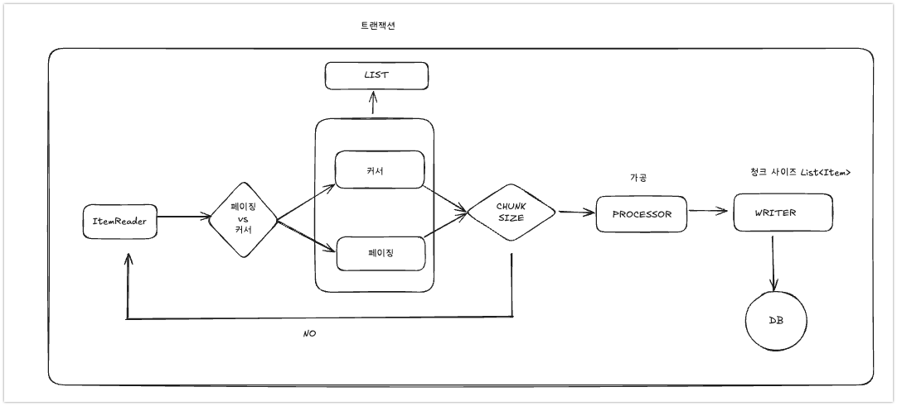

# 5. Chunk

---

### 정의

- 청크란 대량 데이터 처리를 효율적으로 수행하기 위해 사용하는 핵심 개념입니다. 대량 데이터를 작은 단위(Chunk)로 나누어 읽기(Read), 처리하기(Process), 쓰기(Write)를 반복적으로 수행합니다.




- 간단하게 흐름에 대해서 살펴보자면 다음과 같다.

1. ItemReader에서 커서, 페이징 방식에 따라서 Chunk Size만큼 DB에서 가지고 오는 방식이 다르다.
    - `ChunkProvider`에서 ItemReader.read()를 통해서 하나씩 데이터를 읽어온다. > 이후 Chunk에 쌓는다.
    - 쌓은 Chunk가 CHUNK_SIZE가 된다면 Processor에게 전달한다.
2. Chunk Size가 되면 List<Item>을 Processor에게 전달하고 Processor는 이를 가공한다.
3. Processor에게 받은 List<Item>을 DB I/O 작업을 한다. (ItemWriter)

> > ItemReader는 Null이 나와야지 동작을 멈춘다. 즉. 데이터를 다 읽은 시점을 기준이 프로세스 마지막이다.
>
> 여기서 Chunk Size만큼 데이터를 읽어오고 DB I/O 작업을 수행한다. 이때 한번의 반복이 하나의 트랜잭션으로 처리된다.

## 5-2. ItemReader

- itemReader는 다양한 입력으로 데이터를 읽어서 제공하는 인터페이스이다.
    - csv, txt
    - xml, json
    - db, 메세지큐

- 여러 구현체가 ItemReader, ItemStream 인터페이스를 동시에 구현하고 이싿.
    - `ItemStream`은 `파일 스트림 연결 종료, DB 커넥션 연결 종료 등의 장치 초기화 등의 작업`에 사용됩니다.
    - ExecutionContext에 read와 관련된 여러 가지 상태 정보를 저장해 두고 재시작 시 참조됩니다.

### 5-2-1. FlatFileItemReader

- FlatFileItemReader는 CSV 파일을 읽습니다. 다음은 csv 파일의 일부이다.

```csv
courierCode,courierName,deliveryCompany,carrier,shippingCompany
CO0001,김배송,CJ대한통운,일반택배,쿠팡
CO0002,이택배,롯데택배,퀵서비스,마켓컬리
CO0003,박운송,한진택배,화물,이마트
CO0004,최배달,우체국택배,새벽배송,롯데마트
CO0005,Smith,CU편의점택배,당일배송,홈플러스
CO0006,Johnson,CJ대한통운,일반택배,오아시스
CO0007,정배송,롯데택배,퀵서비스,쿠팡
CO0008,강택배,한진택배,화물,마켓컬리
CO0009,Williams,우체국택배,새벽배송,이마트
CO0010,조운송,CU편의점택배,당일배송,롯데마트
CO0011,Brown,CJ대한통운,일반택배,홈플러스
CO0012,윤배달,롯데택배,퀵서비스,오아시스
```

- 해당 파일은 Courier클래스와 같고 ,로 구분자를 처리가 되어져 있다. 이를 읽기 위해서는 다음과 같다.


```java

@Bean
public ItemReader<Courier> itemReader() {
    return new FlatFileItemReaderBuilder<Courier>()
            .name("flatFile")
            .resource(new ClassPathResource("/courierFlat.csv"))
            .fieldSetMapper(new BeanWrapperFieldSetMapper<>())
            .targetType(Courier.class)
            .linesToSkip(1)
            .delimited().delimiter(",")
            .names("courierCode", "courierName", "deliveryCompany", "carrier", "shippingCompany")
            .build();
}


@Bean
public ItemReader<Courier> itemReader() {
    FlatFileItemReader<Courier> itemReader = new FlatFileItemReader<>();
    itemReader.setResource(new ClassPathResource("/courierFlat.csv"));
    itemReader.setLinesToSkip(1); // 헤더 건너뛰기


    DefaultLineMapper<Courier> lineMapper = new DefaultLineMapper<>();

    // DelimitedLineTokenizer 설정
    // CSV 파일의 각 라인을 토큰화하는 역할을 합니다.
    // 기본 구분자는 쉼표(,)이며, 각 컬럼에 매핑될 필드명을 지정합니다.
    // 예: "CO0001,김배송,CJ대한통운" -> ["CO0001", "김배송", "CJ대한통운"]
    DelimitedLineTokenizer tokenizer = new DelimitedLineTokenizer();
    tokenizer.setNames("courierCode", "courierName", "deliveryCompany", "carrier", "shippingCompany");

    // BeanWrapperFieldSetMapper 설정
    // 토큰화된 데이터를 객체(여기서는 Courier)로 매핑하는 역할을 합니다.
    // 필드명을 기준으로 자동으로 객체의 프로퍼티에 값을 설정합니다.
    // 예: "courierCode" -> setCourierCode()를 호출
    BeanWrapperFieldSetMapper<Courier> fieldSetMapper = new BeanWrapperFieldSetMapper<>();
    fieldSetMapper.setTargetType(Courier.class);

    // LineMapper에 tokenizer와 fieldSetMapper 설정
    // LineMapper는 CSV 파일의 한 줄을 읽어서 객체로 변환하는 전체 과정을 관리합니다.
    // 1. tokenizer로 라인을 분리
    // 2. fieldSetMapper로 분리된 데이터를 객체에 매핑
    lineMapper.setLineTokenizer(tokenizer);
    lineMapper.setFieldSetMapper(fieldSetMapper);

    // ItemReader에 lineMapper 설정
    // FlatFileItemReader가 파일에서 읽은 각 라인을 어떻게 처리할지 정의합니다.
    // lineMapper를 통해 String -> Courier 객체로 변환됩니다.
    itemReader.setLineMapper(lineMapper);

    return itemReader;
}
```

### 5-2-2. JsonItemReader

- JSON의 데이터의 Parsing과 Binding을 JsonObjectReader 인터페이스 구현체에게 위임하여 처리하는 ItemReader
- `JacksonJsonObjectReader, GsonJsonObjectReader`의 2개 구현체가 있다.

```java
.reader(new JsonItemReaderBuilder<Courier>()
        .name("jsonFile")
        .resource(new ClassPathResource("/couriers.json"))
        .jsonObjectReader(new JacksonJsonObjectReader<>(Courier.class))
        .build())
```

1. JsonItemReader

- Spring Batch의 ItemReader 구현체 JSON 파일을 읽고 객체로 변환하는 전체 프로세스 관리 실제 JSON 파싱은 JsonObjectReader에게 위임

2. JsonObjectReader

- JSON 파싱을 담당하는 인터페이스 구현체: JacksonJsonObjectReader: ObjectMapper 사용 GsonJsonObjectReader: Gson 사용
  실제 JSON -> 객체 변환 작업은 ObjectMapper나 Gson에게 위임

3. ObjectMapper(Jackson) / Gson

- 실제 JSON 파싱과 객체 바인딩을 수행 JSON 문자열을 Java 객체로 변환(역직렬화) Java 객체를 JSON 문자열로 변환(직렬화)

### 5-3. 커서와 페이지 이해

### `Cursor 처리`

JDBC ResultSet의 기본 메커니즘을 사용합니다. `현재 행에서 커서를 유지하며 다음 데이터를 호출하면 다음 행으로 커서를 이동하며 데이터 반환이 이뤄지는 Streaming 방식의 I/O 입니다.`
ResultSet이 open 될 때마다 next 메서드가 호출되어 DataBase의 데이터 하나가 반환되고 객체와 매핑이 이뤄집니다. `DB Connection이 연결되면 배치 처리가 완료될 때까지
Connection이 유지되기 때문에 DB와 SocketTimeout을 충분히 큰 값으로 설정해야 합니다.` 모든 결과를 메모리에 할당하기 때문에 메모리 사용량이 많아지는 단점이 있습니다. Connection 연결
유지 시간과 메모리 공간이 충분하다면 대량의 데이터 처리에 적합할 수 있습니다.(fetchSize 조절로 한 번에 가져올 수도 있습니다.)

### `Paging 처리`

페이징 단위로 데이터를 조회하는 방식으로 `Page Size만큼 한 번에 메모리로 가져온 다음 한 개씩 데이터를 읽는 방식입니다.` 한 페이지를 읽을 때마다 `커넥션을 맺고 끊기를 반복`하기 때문에 대량의 데이터를
처리하더라도 `SocketTimeout 예외가 거의 발생하지 않습니다.` 시작 행 번호를 지정하고 페이지에 반환시키고자 하는 행의 수를 지정한 후 사용합니다.(offest, limit) 페이징 단위의 결과만 메모리에
할당하기 때문에 `메모리 사용량이 적어지는 장점이 있습니다. 따라서 커넥션 유지 시간이 길지 않고 메모리를 효율적으로 사용해야 하는 데이터 처리에 적합합니다.`

| 비교 기준 | Cursor 방식 | Paging 방식 |
|---------|------------|------------|
| **처리 방식** | • 한 행씩 데이터를 스트리밍<br>• ResultSet 커서 이동으로 데이터 처리 | • 페이지 단위로 데이터 조회<br>• 페이지 크기만큼 데이터 처리 |
| **메모리 사용** | • 전체 결과를 메모리에 할당<br>• 대용량 처리 시 메모리 부담 큼 | • 페이지 단위 결과만 메모리에 할당<br>• 메모리 사용량 효율적 |
| **DB 연결** | • 처리가 완료될 때까지 연결 유지<br>• SocketTimeout 고려 필요 | • 페이지 단위로 연결/해제 반복<br>• 짧은 연결 시간 |
| **성능** | • 데이터 스트리밍으로 처리 속도 빠름<br>• fetchSize로 성능 조절 가능 | • 페이지 단위 처리로 상대적으로 느림<br>• DB 부하 분산 가능 |
| **적합한 상황** | • 충분한 메모리가 있는 환경<br>• 긴 DB 연결 시간 허용 시<br>• 빠른 처리 속도 필요 시 | • 제한된 메모리 환경<br>• 짧은 DB 연결 선호 시<br>• 안정적인 처리 필요 시 |
| **리소스 관리** | • 메모리 관리 주의 필요<br>• 연결 타임아웃 관리 필요 | • 효율적인 메모리 관리<br>• 자동 연결 관리 |


<br/><br/><br/>

---

### 5-3-1. JPA (커서, 페이지)

### >  JpaCursorItemReader


- Cursor 기반의 JPA 구현체로서 EntityManagerFactory 객체가 필요하여 쿼리는 JPQL을 사용합니다. Spring Batch 4.3 버전부터 지원합니다.


```java
@Bean
public JpaPagingItemReader<Customer> jpaPagingItemReader() {
    return new JpaPagingItemReaderBuilder<Customer>()
            .name("jpaPagingItemReader")
            .entityManagerFactory(entityManagerFactory)
            .pageSize(10)
            .queryString("SELECT c FROM Customer c")
            .parameterValues(Collections.singletonMap("name", "ABC"))
            .sortKeys(Collections.singletonMap("id", Order.ASCENDING))
            .build();
}
```

### 처리과정

1. `결국 Open을 하면 EntityManager 생성 > JPQL 실행하여 ResultStream에 데이터를 가져온다.` 
> 실제적으로 Open 작업에서 데이터를 가져오는 작업이 다 끝난다.

2. JpaCursorItemReader는 ResultStream에서 이터레이터로 하나씩 데이터를 가져옵니다
3. Close에서 EntityManager를 닫는다.

<br/>

### JpaPagingItemReader

- JpaPagingItemReader는 페이징 방식으로 데이터를 조회하는 구현체


### 처리과정

1. open에서 엔티티 매니저를 생성
2. JpaPagingItemReader에서 엔티티 매니저로를 사용해 쿼리를 날려 데이터를 가져옵니다.(커넥션 얻고 종료)
3. 이 과정을 청크 사이즈만큼 반복합니다.
4. 더 이상 읽을 데이터가 없으면 엔티티 매니저를 종료합니다.

```java
@Bean
public JpaPagingItemReader<Pay> jpaPagingItemReader() {
    return new JpaPagingItemReaderBuilder<Pay>()
            .name("jpaPagingItemReader")
            .entityManagerFactory(entityManagerFactory)
            .pageSize(chunkSize)
            .queryString("SELECT p FROM Pay p")
            .build();
}
```

> ### Page Size와 Chunk Size를 일치해야 하는 이유
> 일치를 해야되는 이유는 크게 jdbc, mybatis / jpa 로 구분하면 좋을거 같다.
> - mybatis, jdbc는 결국에 한 번에 가져오는 데이터양을 pageSize라고 생각하고 chunkSize는 한 트랜잭션에서 처리할 아이템 수 이다.
> - `일단 2개를 매칭하는 이유는 1. 메모리 최적화, 2. 트랜잭션 정합성이다.`
> - `하지만 JPA의 경우에는 1. 영속성 컨텍스트 관리, N+1 문제 방지 , 2.메모리 최적화 및 자원 최적화의 이유로 일치를 시켜야 한다.`

> - Chunk Size가 50이고 Page Size가 10이라고 가정했을 때, Chunk Size를 채우기 위해 5번의 Read가 발생합니다. 5번의 Read가 발생한 뒤에 itemProcessor로 넘기게 되는데 itemProcessor에서 만약 item의 LazyLoading이 발생한다면 이때 문제가 생깁니다. 이유는 5번의 Read가 발생하는 동안 각각 트랜잭션이 초기화되기 때문입니다. 이 문제는 Page Size와 Chunk Size를 일치시키면 해결할 수 있습니다.

<br/><br/><br/>


### 5-3-2. JDBC (커서, 페이지)


### JdbcCursorItemReader

JDBC 커서와 페이징 처리
JdbcCursorItemReader 상세 설명
JdbcCursorItemReader는 데이터베이스와의 연결을 한 번 맺고 필요한 데이터를 하나씩 가져오는 스트리밍 방식의 Reader입니다.

```java
@Bean
public JdbcCursorItemReader<Pay> jdbcCursorItemReader() {
    return new JdbcCursorItemReaderBuilder<Pay>()
            .fetchSize(chunkSize)
            .dataSource(dataSource)
            .rowMapper(new BeanPropertyRowMapper<>(Pay.class))
            .sql("SELECT id, amount, tx_name, tx_date_time FROM pay")
            .name("jdbcCursorItemReader")
            .build();
}
```


#### 장점

1. 메모리 사용량이 적음 (스트리밍 방식)
2. 실시간 데이터 처리 가능
3. 대용량 데이터 처리에 효율적


#### 단점

1. 긴 시간 동안 데이터베이스 커넥션을 점유
2. `멀티스레드 환경에서 사용 불가`


### JdbcPagingItemReader

- JdbcPagingItemReader는 페이지 단위로 데이터를 조회하며, 병렬 처리가 가능한 Reader입니다.

```java
@Bean
public JdbcPagingItemReader<Pay> jdbcPagingItemReader() {
    Map<String, Order> sortKeys = new HashMap<>();
    sortKeys.put("id", Order.ASCENDING);
    
    return new JdbcPagingItemReaderBuilder<Pay>()
            .pageSize(chunkSize)
            .dataSource(dataSource)
            .rowMapper(new BeanPropertyRowMapper<>(Pay.class))
            .queryProvider(createQueryProvider())
            .name("jdbcPagingItemReader")
            .build();
}

private PagingQueryProvider createQueryProvider() {
    SqlPagingQueryProviderFactoryBean queryProvider = new SqlPagingQueryProviderFactoryBean();
    queryProvider.setDataSource(dataSource);
    queryProvider.setSelectClause("id, amount, tx_name, tx_date_time");
    queryProvider.setFromClause("from pay");
    queryProvider.setWhereClause("where amount >= :amount");
    
    Map<String, Order> sortKeys = new HashMap<>();
    sortKeys.put("id", Order.ASCENDING);
    
    queryProvider.setSortKeys(sortKeys);
    
    return queryProvider.getObject();
}
```


### 장점
1. 멀티스레드 환경 지원
2. 데이터베이스 부하 분산
3. 병렬 처리 가능


### 실무 활용 팁
1. pageSize와 chunkSize는 동일하게 설정
2. 정렬 키는 인덱스가 있는 컬럼으로 설정
3. 조회 성능 최적화를 위한 인덱스 관리
4. 데이터베이스 인덱스 활용


<br/><br/><br/>

### 5-3-3. Mybatis ( 페이지)

### MyBatisPagingItemReader

- Mybatis의 경우에는 페이징을 추천한다. 물론 모든게 거의 비슷하지만 실무에서는 페이징만 사용한다.

### 주의사항
1. `Mybatis의 경우에는 SqlSessionTemplate이 기본적으로 Batch 처리가 되어져 있다.`
2. 페이징 처리시 반드시 Order By 필요
3. 적절한 인덱스를 걸어야 한다.
4. _skiprows: 건너뛸 레코드 수 (자동 계산) _pagesize: 페이지 크기 (pageSize 값과 동일)

```java
@StepScope
@Bean(name = JOB_NAME + "")
public MyBatisPagingItemReader<VO> sabangnetReader(@Value("#{stepExecution}") StepExecution stepExecution) {
    stepExecution.getExecutionContext().put("key", "value");
    
    Map<String, Object> parameterValues = new HashMap<>();
    
    return new MyBatisPagingItemReaderBuilder<SabangnetVO>()
            .sqlSessionFactory(sqlSessionTemplate.getSqlSessionFactory())
            .queryId("test.findMapper")
            .parameterValues(parameterValues)
            .pageSize(CHUNK_SIZE)
            .build();
}


 <select id="findMapper" resultType="vo" parameterType="map">
    select *
        from table
        ORDER BY idx ASC LIMIT #{_skiprows}, #{_pagesize}
</select>
```

### ItemReaderAdapter
- 이미 존재하는 DAO나 다른 서비스를 ItemReader 안에서 사용하고자 할 때 위임하는 역할을 한다.
```java
@Bean
public Step step1() {
    return stepBuilderFactory.get("step")
            .<String, String>chunk(chunkSize)
            .reader(customItemReader())
            .writer(customItemWriter())
            .build();
}

@Bean
public ItemReader<String> customItemReader() {

    ItemReaderAdapter<String> reader = new ItemReaderAdapter<>();
    reader.setTargetObject(customerService()); // 클래스 이름
    reader.setTargetObject("customRead"); // 메서드 명
    return reader;
}


public CustomerService {
    public string customRead(){
        // ... 생략
    }
}

```