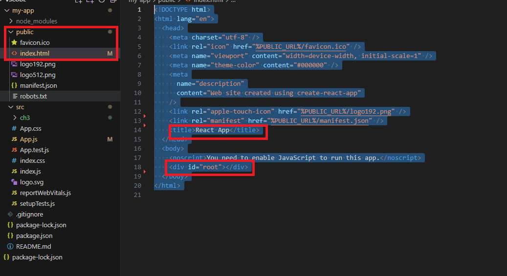

# [ 0318 ] TIL

---

### 목차

1. [리액트](#-서론)
---


# 리액트

---


- 리액트 컴포넌트는 크게 2가지 형식으로 구성이 된다.

```javascript
# 클래스 컴포넌트
class App extends Component{
    render(){
        return <h1>안녕하세요.</h1>;
    }
}

#  함수형 컴포넌트
function App(){
    return <h1>안녕하세요.</h1>
}

```

- 기존에는 클래스 컴포넌트를 많이 사용했지만 리액트 hook이 나오고 함수형 컴포넌트 선호


### 가상돔

- 리액트는 가상돔을 사용한다.

### 브라우저 렌더링 과정 (crp)
- 브라우저가 서버에서 페이지에 대한 html 응답을 받고 화면에 표시하기 전에 여러 단계가 있는데 1. 웹 브라우저가 html 문서를 읽고 스타일 입히고 뷰포트에 표시하는 과정

1. 돔 트리 형성
- 렌더 엔진이 문서를 읽어들이고 그것들을 파싱하고 어떤 내용을 페이지에 렌더링을 할 것인지 판단한다.

2. Render tree 생성
- 이 단계에서는 브라우저가 dom과 cssom을 결합하는 곳이며 이 프로세스는 화면에 보이는 모든 컨텐츠와 스타일 정보 모두 포함하는 최종 렌더링 트리를 출력한다.

3. layout
- 이 단계는 브라우저가 페이지에 표시되는 각 요소의 크기와 위치를 계산하는 단계이다.

4. paint
- 실제 화면에 그리기

### 문제점
- 어떤 인터렉션에 의해서 dom의 변화가 발생하면 그 때 마다 render tree가 재생성되어서 모든 스타일 다시 계산,  layout, repaint 과정을 가치게 된다.

- 만약에 인터렉션이 많다면 많은 비용을 지불하게 된다. 그러니 불필요하게 dom을 조작하는 비용을 줄이기 위해서 가삼 돔을 사용한다.

- 가상 돔이란 실제 dom을 메모리에 복사해준 것


> Dom이란 Document Object Model의 약자로 문서 객체 모델을 의미한다. 이때 문서 객체는 html, head,body와 같은 태그들을 js가 이용할 수 있는 객체를 의미한다.
이때 div, input, a 등이 dom에 해당한다.

### 가상 돔
- 가상 돔은 실제 dom을 메모리에 복사하는 것

### 가상 돔 동작 방식


- 가상 돔이 2개가 있다. 이때 이전의 가상 돔을 도미라고 부르며 이번에 바뀐 돔에서 도미와 비교하여 바뀐 부분만 실제 돔에 적용하는 방식을 가진다.
- 바뀐 부분을 찾는 과정을 `Diffing`이라고 부른다. 바뀐 부분만 실제 돔에 적용시켜주는 것을 재조정(reconciliation)이라고 부른다.


### 리액트 설치 방법
```js
npx create-reat-app <프로젝트명>
```
- 원래는 리액트 앱을 설치하기 위해서는 webpack이나 babel 같은 모듈을 설치하고 설정해야 리액트 앱을 시작할 수 있었다. 

> 웹펙이란
> - 웹팩은 오픈 소스 자바스크립트 모듈 번들로러써 여러개로 나누어져 있는 파일들을 하나의 자바스크립트 파일로 합쳐주는 역할을 한다.
> - 이를 통하여 여러 파일의  js 코드를 압축하여 최적화 할 수 있고 이를 통해 로딩에 대한 네트워크 비용을 줄일 수 있다.
> - 모듈 단위로 개발이 가능하고 가동성, 유지보수에 유용하다.


```
my-app/
    readme.md
    node_modules/
    package.json
    public/
        index.html
        favicon.ico
    src/
        App.css
        App.js
        App.test.js
        index.css
        index.js
        logo.svg
```

- public 폴더와 src 폴더에 있는 index.html, index.js 파일을 수정하면 안된다.

public/ 폴더에 있는 것은 오직 index.html만 사용하고 src/ 폴더에 있는 파일은 js, css 파일들을 넣는다. 그리고 webpack이 src/폴더만 본다. 그래서 이 폴더 이외에 넣는 것은 webpack이 감지하지 못한다.


### package.json
- 해당 프로젝트에 대한 정보들이 들어있다. 프로젝트 이름, 버전, 필요한 라이브러리와 버전을 명시한다. npm run start를 할 때 사용할 스크립트, 빌드, 테스트할 때 사용할 스크립트도 명시되어져 있다.


```json
{
  "name": "my-app",
  "version": "0.1.0",
  "private": true,
  "dependencies": {
    "@testing-library/jest-dom": "^5.17.0",
    "@testing-library/react": "^13.4.0",
    "@testing-library/user-event": "^13.5.0",
    "react": "^18.2.0",
    "react-dom": "^18.2.0",
    "react-scripts": "5.0.1",
    "web-vitals": "^2.1.4"
  },
  "scripts": {
    "start": "react-scripts start",
    "build": "react-scripts build",
    "test": "react-scripts test",
    "eject": "react-scripts eject"
  },
  "eslintConfig": {
    "extends": [
      "react-app",
      "react-app/jest"
    ]
  },
  "browserslist": {
    "production": [
      ">0.2%",
      "not dead",
      "not op_mini all"
    ],
    "development": [
      "last 1 chrome version",
      "last 1 firefox version",
      "last 1 safari version"
    ]
  }
}
```

- 여기서 dependencies는 필요한 라이브러리와 버전을 명시한다.
- script에서는 리액트 앱 실행, 빌드,  테스트 등의 스크립트를 명시하고 있다. 프로젝트에서 자주 실행해야 하는 명령어는 script로 작성해두면 npm 명령어로 실행 가능하다.
- eslintConfig : 소스 코드를 입력할 때 문법이나 코드 포맷을 체크한다.




- 이 파일은 public/index.html 파일이다. 여기서 리액트 앱이 실행될 때 가장 먼저 로딩되는 파일이다.
- 여기서 div 엘레먼트의 id를 root로 설정한다. 만약에 다른 경로로 하면 찾을 수 없다.


- 이 파일은 src/index.js 파일이다. 여기서 리액트 앱이 실행될 때 가장 먼저 로딩되는 파일이다. 여기서 살펴보면 document.getElementById를 통하여 접근한다. 이때 root는 public/index.html에 있는 id이다.


### Single Page Application(SPA)
- SPA란 기존의 n개의 html 파일을 바꾸는 multi page application 이였지만 SPA는 하나의 페이지에서 모든 것을 처리한다.
- `웹 사이트의 전체 페이지를 하나의 페이지에 담아 동적으로 화면을 바꿔가며 표현`
- 기존에 mpa에서 spa가 가능한 이유는 html 5의 history api를 사용하여 자바스크립트 영역에서 history api를 이용해서 현재 페이지 내에서 화면 이동이 일나난 것처럼 자동하게 한다.


### JSX (Javascript syntax extension)
- jsx는 자바스크립트의 확장 문법이다. 리액트에서는 이 jsx를 이요해서 화면에서 ui가 보이는 모습으로 나타낸다.
```js
const simple = <h1>안녕하세요.</h1>;
```

- jsx를 이용하면 ui를 나타낼 때 자바스크립트와 html을 같이 사용할 수 있기 때문에 기본 ui에 데이터가 변하는 것들이나 이벤트를 쉽게 처리할 수 잇다.


- 이때 jsx를 사용하는 이유는 모든 ui를 만들때 마다 createElement를 사용해서 컴포넌트로 만들 수 없다. 그래서 바벨이 다시 createElement로 바꿔서 하용한다.


### jsx를 사용하면서 주의해야 할 문법
1. jsx는 컴포넌트에 여러 엘리먼트 요소가 있다면 반드시 부모 요소 하나를 감싸야한다.
```js
# fail
function hello(){
    return(
            <h1>안녕하세요.</h1>
            <h2>반갑습니다.</h2>
    )
}

# success
function hello(){
    return(
        <div>
            <h1>안녕하세요.</h1>
            <h2>반갑습니다.</h2>
        </div>
)
}
```


## React State
- 리액트에서 데이터가 변할 때 화면을 다시 렌더링 해주기 위해서 React State를 사용해야된다.

> React State란
- 컴포넌트의 렌더링 결과물에 영향을 주는 데이터를 갖고 있는 객체, state가 변경되면 컴포넌트는 리랜더링한다., 또한 state는 컴포넌트 안에서 관리한다.

### 전개 연산자
전개 연산자는 es6에 새롭게 추가되었다. 특정 객체 또는 배열의 값을 다른 객체, 배열로 복제하거나 옮길 때 사용한다. 연산자 모양은 ... 으로 생겼다.
즉. 객체, 배열의 값을 복제한다.

```js
const arr1 = [1,2,3,4];
const arr2 = [5,6,7,8,9];

const result1 = arr1.concat(arr2);
const result2 = [...arr1, ...arr2]

console.log(result1);
console.log(result2);


Array.prototype.push.apply(arr1,arr2);

console.log(arr1);

arr1.push(...arr2);
console.log(arr1);

const obj1 = {
"a":1,
"b":2
};

const obj2 = {
"c":3,
"d":4
}

const object = {obj1,obj2};
console.log(object);


let test = {...obj1, ...obj2};
console.log(test);
```

1. 일단 코드너리, cs 학습,이펙티브 자바
