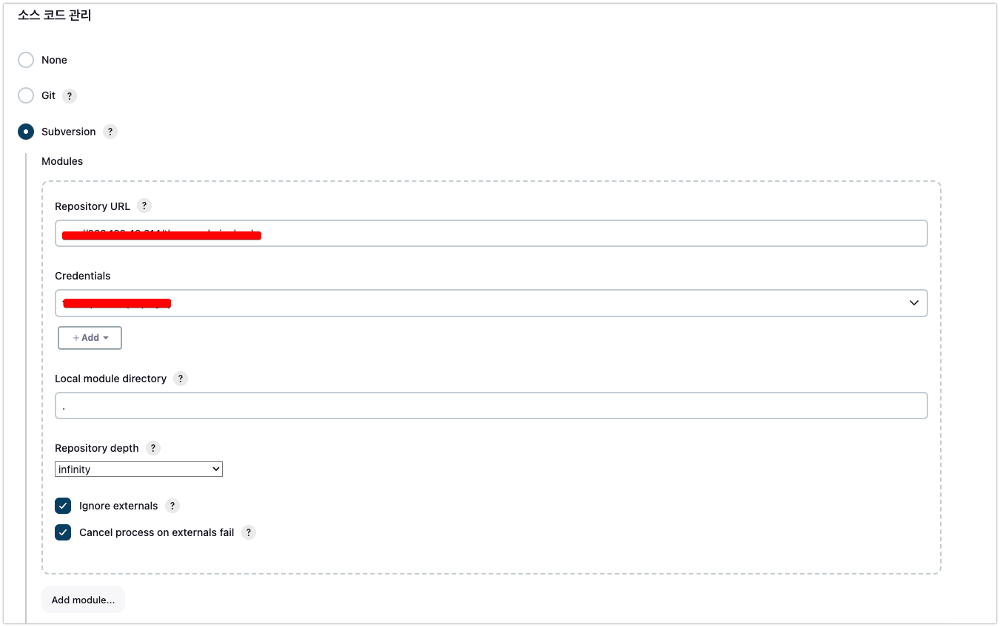
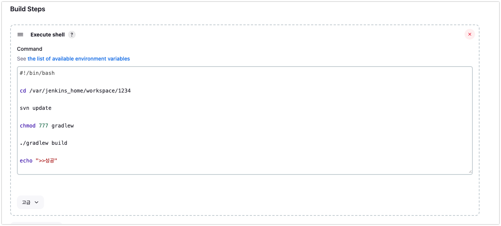

# [ 0513 ] TIL

--- 

- [x] [Jenkins CodeDeploy CI/CD](#jenkins-codedeploy-cicd)
- [x] [코드트리](#코드트리-5문제)
- [x] [VPC](#vpc란)

---

## Jenkins CodeDeploy CI/CD

- 환경 : ubuntu20.04, docker, jenkins

### AWS EC2 인스턴스 메모리 부족 해결을 위해 SWAP 할당 및 docker, jenkins 설치
```shell
sudo dd if=/dev/zero of=/swapfile bs=128M count=32

sudo chmod 600 /swapfile

sudo mkswap /swapfile

sudo swapon /swapfile

sudo swapon -s

sudo vi /etc/fstab
--------------------
[ vi에 하단에 추가 ]
/swapfile swap swap defaults 0 0
----------------------
## 용량 확인
free

# 오래된 버전 삭제
sudo apt-get remove docker docker-engine docker.io containerd runc

sudo apt-get update
# repository 설정
sudo apt-get -y install \
    apt-transport-https \
    ca-certificates \
    curl \
    gnupg \
    lsb-release

# Docker의 Official GPG Key 를 등록
curl -fsSL https://download.docker.com/linux/ubuntu/gpg | sudo gpg --dearmor -o /usr/share/keyrings/docker-archive-keyring.gpg

# stable repository 를 등록
echo \
  "deb [arch=amd64 signed-by=/usr/share/keyrings/docker-archive-keyring.gpg] https://download.docker.com/linux/ubuntu \
  $(lsb_release -cs) stable" | sudo tee /etc/apt/sources.list.d/docker.list > /dev/null

sudo apt-get update

# Docker Engine 설치
sudo apt-get -y install docker-ce docker-ce-cli containerd.io

# 설치 완료 확인, 버전 확인
docker --version

# /var/run/docker.sock 접근 권한 허용
sudo chmod 666 /var/run/docker.sock

# docker hub 로그인 id/pw 입력
docker login

docker run \
  --name jenkins-docker \
  -p 8080:8080 -p 50000:50000 \
  -v /home/jenkins:/var/jenkins_home \
  -v /var/run/docker.sock:/var/run/docker.sock \
  -v /usr/bin/docker:/usr/bin/docker \
  -u root \
  -d \
  jenkins/jenkins:lts
  
 
 # jenkins 컨테이너 접속
docker exec -it [jenkins 컨테이너ID] bin/bash

# jenkins 컨테이너 log 확인
docker logs [jenkins 컨테이너ID]
```

### ubuntu, CodeDeploy 설치

```shell

sudo apt-get update

# ubuntu 16.04
sudo apt-get install ruby

# ubuntu 14.04
sudo apt-get install ruby2.0

sudo apt-get install wget

# install 파일 경로는 원하는 대로 가능
cd /home/ubuntu

# bucket-name과 region-identifier를 각자의 상황에 맞게 변경
# wget https://<bucket-name>.s3.<region-identifier>.amazonaws.com/latest/install

# Seoul region
wget https://aws-codedeploy-ap-northeast-2.s3.ap-northeast-2.amazonaws.com/latest/install

chmod +x ./install
sudo ./install auto

# codedeploy-agent 상태 확인
sudo service codedeploy-agent status

# codedeploy-agent 서비스 시작
sudo service codedeploy-agent start
```






### appspec.yml
```shell
version: 0.0
os: linux
files:
  - source:  /
    destination: /home/ubuntu
    overwrite: yes

permissions:
  - object: /
    pattern: "**"
    owner: ubuntu
    group: ubuntu

hooks:
  AfterInstall:
    - location: script/deploy.sh
      timeout: 180
      runas: ubuntu
  ApplicationStart:
    - location: script/switch.sh
      timeout: 180
      runas: ubuntu

```

- 여기서 AfterInstall에서 deploy을 수행하고 ApplicationStart에서 switch를 한다.


### deploy.sh
```shell
#!/bin/bash
BASE_PATH=/home/ubuntu
BUILD_PATH=$(ls $BASE_PATH/build/libs/*.jar)
BASE_APPLICATION_NAME=tbnws_admin_back.jar

JAR_NAME=${BASE_APPLICATION_NAME}
#$(basename $BUILD_PATH)
echo "> build 파일명: $JAR_NAME"

echo "> build 파일 복사"
DEPLOY_PATH=$BASE_PATH/jar/
# Build Path -> Deploy Path로 변경
cp $BUILD_PATH $DEPLOY_PATH

echo "> 현재 구동중인 Set 확인"
CURRENT_PROFILE=$(curl -s http://localhost/profile)
echo "> $CURRENT_PROFILE"


# 쉬고 있는 set 찾기: blue 사용중이면 green 쉬고 있고, 반대면 blue 쉬고 있음
if [ $CURRENT_PROFILE == blue ]
then
  IDLE_PROFILE=green
  IDLE_PORT=8082
elif [ $CURRENT_PROFILE == green ]
then
  IDLE_PROFILE=blue
  IDLE_PORT=8081
else
  echo "> 일치하는 Profile이 없습니다. Profile: $CURRENT_PROFILE"
  echo "> set1을 할당합니다. IDLE_PROFILE: set1"
  IDLE_PROFILE=blue
  IDLE_PORT=8081
fi

echo "> application.jar 교체"
IDLE_APPLICATION=$IDLE_PROFILE-$BASE_APPLICATION_NAME
echo "> IDLE_APPLICATION 이름 : ${IDLE_APPLICATION}"

IDLE_APPLICATION_PATH=$DEPLOY_PATH$IDLE_APPLICATION
echo "> IDLE_APPLICATION_PATH 이름 : ${IDLE_APPLICATION_PATH}"


ln -Tfs $DEPLOY_PATH$JAR_NAME $IDLE_APPLICATION_PATH

echo "> $IDLE_PROFILE 에서 구동중인 애플리케이션 pid 확인"
IDLE_PID=$(pgrep -f $IDLE_APPLICATION)


# -z는 길이가 0인지 판단한다. 즉. PID가 비어있는지 확인한다.
if [ -z $IDLE_PID ]
then
  echo "> 현재 구동중인 애플리케이션이 없으므로 종료하지 않습니다."
else
  echo "> kill -15 $IDLE_PID"
  kill -15 $IDLE_PID
  sleep 5
fi

echo "> $IDLE_PROFILE 배포"
sudo nohup java -jar -Dspring.profiles.active=$IDLE_PROFILE $IDLE_APPLICATION_PATH 1>/dev/null 2>&1 &

echo "> $IDLE_PROFILE 10초 후 Health check 시작"
echo "> curl -s http://localhost:$IDLE_PORT/actuator/health "
sleep 10

for retry_count in {1..10}
do
  response=$(curl -s http://localhost:$IDLE_PORT/actuator/health)
  up_count=$(echo $response | grep 'UP' | wc -l)

  if [ $up_count -ge 1 ]
  then # $up_count >= 1 ("UP" 문자열이 있는지 검증)
      echo "> Health check 성공"
      break
  else
      echo "> Health check의 응답을 알 수 없거나 혹은 status가 UP이 아닙니다."
      echo "> Health check: ${response}"
  fi

  if [ $retry_count -eq 10 ]
  then
    echo "> Health check 실패. "
    echo "> Nginx에 연결하지 않고 배포를 종료합니다."
    exit 1
  fi

  echo "> Health check 연결 실패. 재시도..."
  sleep 10
done
```

```shell
#!/bin/bash
echo "> 현재 구동중인 Port 확인"
CURRENT_PROFILE=$(curl -s http://localhost/profile)

# 쉬고 있는 set 찾기: set1이 사용중이면 set2가 쉬고 있고, 반대면 set1이 쉬고 있음
if [ $CURRENT_PROFILE == blue ]
then
  IDLE_PORT=8082
elif [ $CURRENT_PROFILE == green ]
then
  IDLE_PORT=8081
else
  echo "> 일치하는 Profile이 없습니다. Profile: $CURRENT_PROFILE"
  echo "> 8081을 할당합니다."
  IDLE_PORT=8081
fi

echo "> 전환할 Port: $IDLE_PORT"
echo "> Port 전환"
echo "set \$service_url http://127.0.0.1:${IDLE_PORT};" |sudo tee /etc/nginx/conf.d/service-url.inc

PROXY_PORT=$(curl -s http://localhost/profile)
echo "> Nginx Current Proxy Port: $PROXY_PORT"

echo "> Nginx Reload"
sudo service nginx reload
```

### nginx 설치

```shell
sudo apt install nginx

ps -ef | grep nginx

ubuntu@ip-172-31-32-5:/etc/nginx/conf.d$ pwd 
/etc/nginx/conf.d
ubuntu@ip-172-31-32-5:/etc/nginx/conf.d$ cat service-url.inc 
set $service_url http://127.0.0.1:8082;
ubuntu@ip-172-31-32-5:/etc/nginx/conf.d$ 


include /etc/nginx/conf.d/service-url.inc;

location / {
        proxy_pass $service_url;
        # First attempt to serve request as file, then
        # as directory, then fall back to displaying a 404.
        # try_files $uri $uri/ =404;
}
```


## 코드트리 5문제

## VPC란