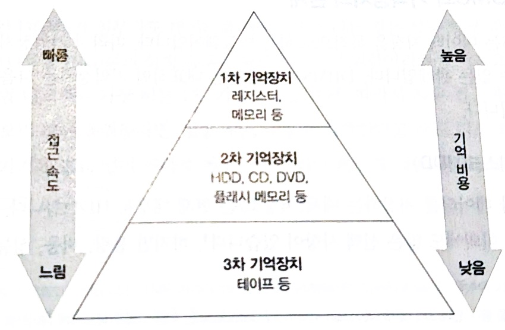
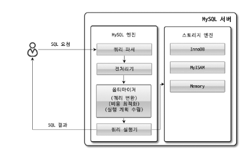

# 디비 아키텍처

---

- 현재 rdb 제품은 oracle, h2, mysql, mssql, postgresql 등 다양하게 있다. 
- 각각의 제품마다 디비 아키텍처의 차이점이 있다. 
- 많은 제품 중에서 mysql의 아키텍처에 대해서 정리를 하겠다.

## rdbms 아키텍처

 
 
### 1. 쿼리 평가 엔진
- 입력받은 sql을 분석하고 어떤 순서로 기억장치의 데이터에 접근할지 결정한다. -> 순서는 실행 계획이 정한다.

```sql
접근 메서드
- 실행 계획에 기반을 둬서 데이터에 접근하는 방법
```

> sql 쿼리구문을 받아 실행계획을 수립하는 역할을 한다.

### 2. 버퍼 매니저
- 디비에서 사용하는 버퍼를 메모리 영역에 관리하는 것
- 디스크 용량 매니저와 함께 연동하여 작동한다.

### 3. 디스크 용량 매니저
- 디비를 사용하면서 데이터를 적재하면 데이터를 영구적으로 저장을 해야된다. 이때 디스크 매니저는 어디에 어떻게 저장할지 관리하여
효율적으로 디비를 사용할 수 있도록 만들어준다.

### 4. 트랜잭션 매니저와 락 매니저
- n명의 사람들이 요청하면 데이터 정합성을 유지하면서 실행해야 된다. 이때 트랜잭션을 사용한는데 매니저와 락이 처리한다.

### 5. 리커버리 매니저
- 관계형 디비는 데이터를 저장하고 데이터의 손실을 잊어버리면 안된다. 하지만 시스템은 언제나 장애가 발생할 수 있다. 따라서 이러한 상황에서 복구해줘야 하는데 이러한 기능을 수행한다.

## 2강 dbms와 버퍼


- 기억장치의 계층을 살펴보면 위에 사진과 같다.일반적으로 3계층을 사용한다.
- ``기억비용`` :기억 비용이란 데이터를 저장하는데 소모하는 비용이다. 위에 계층에 있을 수록 속도가 빠르지만 비용이 높다. 즉. 저장할 수 있는 용량이 낮다.

- 일반적으로 관계형 디비는 hdd 하드 디스크에 저장합니다. 하지만 성능을 위해서 일부의 데이터는 메모리에 올린다.
- 즉. 관계형 디비에서 데이터는 하드 디스크에 저장하고 sql구문의 실행 속도를 빠르게 만들기 위한것이다.

### 메모리 위에 있는 두 개의 버퍼

- rdbms가 데이터를 유지하기 위해 사용하는 메모리는 게 2가지 종류이다.
1. 데이터 캐시
- 데이터 캐시는 디스크에 있는 데이터의 일부를 메모리에 유지하기 위해 사용하는 메모리 영역
- select 구문에서 선택하고 싶은 데이터가 캐시에 있으면 하드디스크에 접근하지 않고 캐시에 있으면 빠르게 접근할 수 있다.

2. 로그 버퍼
- 로그 버퍼는 write작업과 관련이 있다. 처음에 로그 버퍼에서 변경하고 이후 하드 디스크에 저장한다.

### 메모리 좋지만 트레이드오프 알아보자
- 메모리를 예를 들면 레디스로 생각하면 쉽다. 메모리는 휘발성 데이터이다. 메모리는 영구적으로 저장하지 않는다.
- 컴퓨터를 끄면 데이터가 사라지는 휘발성 특징이 있다.


- 사용자가 write작업을 수행하면 로그 버퍼에서 갱신하고 이후 로그 버퍼에서 비동기로 데이터를 저장을합니다.
- 사용자가 select를 하면 데이터 캐시에서 가져오고 만약에 없으면 하드디스크에서 가져옵니다.

### 워킹 메모리 - 추가적인 메모리 영역

- 사용 시점 : 정렬 또는 해시 관련 처리에서 사용되는 작업용 영역으로 워킹 메모리를 사용한다.
- 정렬은 order by, 집합 연산, 윈도우 함수등의 기능을 사용할 때 실행한다. 반면 해시는 주로 테이블의 결합에서 해시 결합을 사용한다.

> mysql에서는 워킹 메모리가 아니라 정렬 버퍼로 불린다. 


### 3강 dbms와 실행 계획




- 쿼리가 어떻게 처리되고 실제로 데이터 접근이 어떻게 이루어지는지 나타낸다.

1. 파서
- 파서의 역활은 sql을 받은 것을 구문 분석을 한다. 사용자가 쉼표를 잊거나 from을 잊으면 에러가 발생한다.
- 또한 파서에서 sql구문을 정형적인 형식으로 변환해준다. 그렇게 해야지 dbms 내부에서 일어나는 후속 처리가 효율적으로 발생한다.

2. 쿼리 전처리기
- 테이블의 실존 여부, 권한 등 런타임에만 판단 가능한 부분을 실제로 실행 가능한 쿼리인지 판단한다.

> 즉 파서는 정적 단계에서 쿼리를 검사하고 쿼리 전처리기는 런타임에 오류를 검사를 한다.

3. 옵티마이저
- 해당 쿼리를 효율적으로 사용할 수 있는 실행 계획을 세운다. 쿼리 튜닝의 핵심으로 통계정보에 따라서 달라질 수 있다.
- 고려 사항 : (1) 선택 가능한 실행 계획을 여러개 만들고 (2) 이들의 비용을 연산하여 (3) 가장 낮은 비용을 가진 실행 계획을 선택한다.

4. 카탈로그 매니저
- 옵티마이저가 실행 계획을 결정하기 위해 데이터베이스의 메타 데이터( 테이블 구조, 인덱스, 데이터 분포 )를 분석을 한다.
- 이때 카탈로그 매니저가 옵티마이저에서 중요한 정보를 관리한다.

5. 플랜 평가
- 옵티마이저가 sql구문에서 여러 개의 실행 계획을 세운 뒤 그것을 최적화한 실행 결과를 선택을 하는 것이 플랜 평가