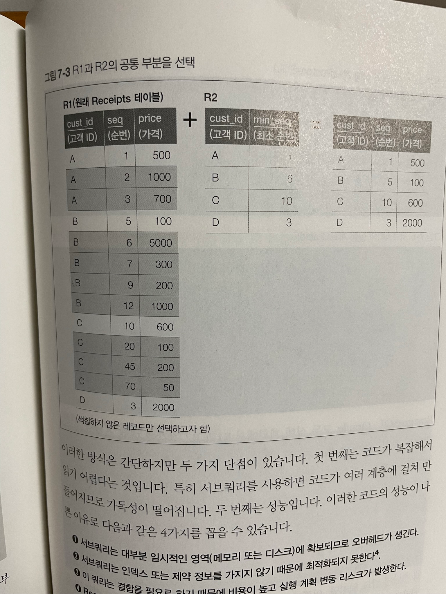

# 서브쿼리

---

## 서브쿼리
- sql을 공부하면서 항상 듣는 말은 서브쿼리, 조인에서 조인을 우선시하라 이다. 왜 그런지 살펴보쟈

- 단점
  1. 연산 비용 추가
     - 실체적인 데이터를 저장하지 않는다. 결국 서브쿼리를 접근할 때 select를 실행시켜 추가적인 비용이 발생한다.
  2. 데이터 i/o 비용 발생
      - 서브쿼리의 결과는 결국 어디에 저장을 해야한다. 이때 db마다 저장하는 방식이 다르긴 하지만 tempdb, 임시 테이블에 주로 저장을 한다. mysql에서는 임시 테이블에서 저장을 한다. 
      - **임시 테이블은 세션 내에서만 존재하며, 세션이 종료되면 자동으로 삭제됩니다. 따라서 다른 사용자가 임시 테이블에 접근하거나 수정하는 것은 불가능합니다.**
  
  3. 최적화를 받을 수 없음
    - 서브쿼리로 만들어지는 데이터는 비슷하지만 결국 제일 주요한 차이점은 **메타 데이터**이다.
    - 인덱스 또는 fk등 제약 조건은 메타 데이터에 존재한다. 하지만 서브쿼리는 메타 데이터가 없다. 그래서 결국 쿼리를 해석하기 위해 최적화가 불가능하다.


### 의존증

```sql
CREATE TABLE Receipts
(cust_id   CHAR(1) NOT NULL,
 seq   INTEGER NOT NULL,
 price   INTEGER NOT NULL,
     PRIMARY KEY (cust_id, seq));

INSERT INTO Receipts VALUES ('A',   1   ,500    );
INSERT INTO Receipts VALUES ('A',   2   ,1000   );
INSERT INTO Receipts VALUES ('A',   3   ,700    );
INSERT INTO Receipts VALUES ('B',   5   ,100    );
INSERT INTO Receipts VALUES ('B',   6   ,5000   );
INSERT INTO Receipts VALUES ('B',   7   ,300    );
INSERT INTO Receipts VALUES ('B',   9   ,200    );
INSERT INTO Receipts VALUES ('B',   12  ,1000   );
INSERT INTO Receipts VALUES ('C',   10  ,600    );
INSERT INTO Receipts VALUES ('C',   20  ,100    );
INSERT INTO Receipts VALUES ('C',   45  ,200    );
INSERT INTO Receipts VALUES ('C',   70  ,50     );
INSERT INTO Receipts VALUES ('D',   3   ,2000   );
```

- 여기서 각 순번의 최소값을 구하고 싶지만 단순한 쿼리로는 한계가 있다. 이것을 서브쿼리를 통해서 해결하면
  
```sql
SELECT R1.cust_id, R1.seq, R1.price
FROM Receipts R1
INNER JOIN
  (SELECT cust_id, MIN(seq) AS min_seq
  FROM Receipts
  GROUP BY cust_id) R2
ON R1.cust_id = R2.cust_id AND R1.seq = R2.min_seq;
```

###  위 쿼리의 단점

1. 서브쿼리는 대부분 일시적인 영역을 사용해야 하기 때문에 오버헤드가 생긴다.
2. 서브쿼리는 메타 데이터를 가지지 못하기 때문에 인덱스를 사용할 수 없어 최적화가 불가능하다.
3. 추가적인 결합, 테이블 스캔이 필요하여 비용이 높다.


> 이를 살펴보면 결국 nested loops가 mysql에서 사용되며 2번 테이블을 접근한다.

### 실행계획 살펴보기
```sql
-> Nested loop inner join  (cost=4.81 rows=5) (actual time=2.97..2.98 rows=4 loops=1)
    -> Filter: (r2.min_seq is not null)  (cost=2.21..3.06 rows=5) (actual time=2.19..2.19 rows=4 loops=1)
        -> Table scan on R2  (cost=2.51..4.56 rows=5) (actual time=1.82..1.83 rows=4 loops=1)
            -> Materialize  (cost=2..2 rows=5) (actual time=1.75..1.75 rows=4 loops=1)
                -> Covering index skip scan for grouping on Receipts using PRIMARY  (cost=1.5 rows=5) (actual time=0.584..0.661 rows=4 loops=1)
    -> Single-row index lookup on R1 using PRIMARY (cust_id=r2.cust_id, seq=r2.min_seq)  (cost=0.27 rows=1) (actual time=0.0284..0.0286 rows=1 loops=4)

```

1. Nested loop inner join (cost=4.81 rows=5) (actual time=2.97..2.98 rows=4 loops=1)  
이 부분은 R1 테이블과 서브쿼리 R2의 결과를 결합하는 작업을 나타냅니다. 이 작업은 쿼리의 INNER JOIN 부분에 해당합니다.
Nested loop은 모든 가능한 행 조합을 검사하는 가장 기본적인 결합 알고리즘입니다. 이 경우, R1의 각 행에 대해 R2의 모든 행을 검사하며, 조인 조건이 맞는 행을 결과로 반환합니다.

2. Filter: (r2.min_seq is not null) (cost=2.21..3.06 rows=5) (actual time=2.19..2.19 rows=4 loops=1)  
이 부분은 R2의 min_seq 값이 null이 아닌 행만 선택하는 필터 작업을 나타냅니다. 이 작업은 쿼리의 ON R1.cust_id = R2.cust_id AND R1.seq = R2.min_seq 부분에 해당합니다.
Table scan on R2 (cost=2.51..4.56 rows=5) (actual time=1.82..1.83 rows=4 loops=1)  
이 부분은 R2 테이블의 모든 행을 스캔하는 작업을 나타냅니다. 이 작업은 서브쿼리 R2의 결과를 생성하는 부분에 해당합니다.

3. Materialize (cost=2..2 rows=5) (actual time=1.75..1.75 rows=4 loops=1)  
이 부분은 서브쿼리 R2의 결과를 일시적인 테이블에 저장하는 작업을 나타냅니다. 이 작업은 쿼리 최적화 과정에서 발생하며, 서브쿼리의 결과를 여러 번 사용해야 할 때 비용을 줄이는 데 도움이 됩니다.

4. Covering index skip scan for grouping on Receipts using PRIMARY (cost=1.5 rows=5) (actual time=0.584..0.661 rows=4 loops=1)  
이 부분은 Receipts 테이블에서 그룹화를 위해 인덱스를 사용하는 작업을 나타냅니다. 이 작업은 서브쿼리 R2의 GROUP BY cust_id 부분에 해당합니다.

5. Single-row index lookup on R1 using PRIMARY (cust_id=r2.cust_id, seq=r2.min_seq) (cost=0.27 rows=1) (actual time=0.0284..0.0286 rows=1 loops=4)
이 부분은 R1 테이블에서 인덱스를 사용하여 단일 행을 조회하는 작업을 나타냅니다. 이 작업은 쿼리의 ON R1.cust_id = R2.cust_id AND R1.seq = R2.min_seq 부분에 해당합니다. 이 작업은 R1 테이블의 PRIMARY 키를 사용하여 특정 행을 빠르게 찾습니다.


### 동치 변환 -> 상관 서브쿼리

```sql
-> Filter: (r1.seq = (select #2))  (cost=1.55 rows=13) (actual time=2.45..2.55 rows=4 loops=1)
-> Table scan on R1  (cost=1.55 rows=13) (actual time=0.0856..0.0903 rows=13 loops=1)
-> Select #2 (subquery in condition; dependent)
        -> Aggregate: min(r2.seq)  (cost=0.901 rows=1) (actual time=0.0664..0.0664 rows=1 loops=13)
            -> Covering index lookup on R2 using PRIMARY (cust_id=r1.cust_id)  (cost=0.576 rows=3.25) (actual time=0.0103..0.012 rows=3.92 loops=13)

explain analyze SELECT cust_id, seq, price
                from Receipts R1
                WHERE seq = (SELECT MIN(seq)
                             FROM Receipts R2
                             WHERE R1.cust_id = R2.cust_id);
```

- 이 쿼리를 살펴보면 결국 2번의 테이블 스캔이 일어난다. 위에 쿼리와 비교하면 큰 차이가 없는걸 알 수 있다.

### 윈도우 함수로 동치 변환하기

- 테이블 접근을 윈도우 함수를 이용해서 테이블 접근을 1번으로 줄일 수 있다.
```sql
-> Index lookup on WORK using <auto_key0> (row_seq=1)  (cost=0.35..0.455 rows=1.3) (actual time=0.822..0.829 rows=4 loops=1)
    -> Materialize  (cost=0..0 rows=0) (actual time=0.811..0.811 rows=13 loops=1)
        -> Window aggregate: row_number() OVER (PARTITION BY receipts.cust_id ORDER BY receipts.seq )   (actual time=0.402..0.425 rows=13 loops=1)
            -> Sort: receipts.cust_id, receipts.seq  (cost=1.55 rows=13) (actual time=0.0867..0.0918 rows=13 loops=1)
                -> Table scan on Receipts  (cost=1.55 rows=13) (actual time=0.0478..0.0562 rows=13 loops=1)

explain analyze SELECT cust_id, seq, price
from (SELECT cust_id, seq, price,
               ROW_NUMBER()
                 OVER (PARTITION BY cust_id
                           ORDER BY seq) AS row_seq
          FROM Receipts ) WORK
 WHERE WORK.row_seq = 1;

```

- 이를 살펴보면 테이블 접근을 1번만 하고 min과 비교를 하였을 때 비용의 큰 차이가 발생하지 않기 때문에 성능적으로 좋다고 생각할 수 있다.

### 장기적인 관점에서
- 최초의 쿼리, 상관 서브쿼리, 윈도우 함수를 통해서 문제를 해결했지만 사용하는 db, 성능, 인덱스등 다양한 요소에 의해서 바뀔 수 있다.
- 하지만 db의 가장 처음 튜닝의 기본은 비용을 줄이는 거다. 

- 처음 사용한 쿼리와 비교하면 결합을 제거하고 성능 향상, 안전성 확보에도 기대할 수 있다.

## 서브쿼리 의존증  - 응용

```sql
SELECT TMP_MIN.cust_id,
       TMP_MIN.price - TMP_MAX.price AS diff
    from (SELECT R1.cust_id, R1.seq, R1.price
          FROM Receipts R1
                 INNER JOIN
                  (SELECT cust_id, MIN(seq) AS min_seq
                     FROM Receipts
                    GROUP BY cust_id) R2
            ON R1.cust_id = R2.cust_id
           AND R1.seq = R2.min_seq) TMP_MIN
       INNER JOIN
       (SELECT R3.cust_id, R3.seq, R3.price
          FROM Receipts R3
                 INNER JOIN
                  (SELECT cust_id, MAX(seq) AS min_seq
                     FROM Receipts
                    GROUP BY cust_id) R4
            ON R3.cust_id = R4.cust_id
           AND R3.seq = R4.min_seq) TMP_MAX
    ON TMP_MIN.cust_id = TMP_MAX.cust_id;
```

-  tmp_min이 최소값의 집합 / tmp_max는 최대값의 집합이다. 이 쿼리는 두 번 붙여넣기 한것이기 때문에 테이블에 대한 접근이 2개가 되어 총 4번이 이루어지게 된다.
- 위에 말한거 처럼 결국 테이블 접근을 줄여 비용을 최소화를 목적을 가져야하는 우리는 이 방식에 대해서 의문을 가질 수 있다.

이것을 윈도우 함수로 풀어내면 다음과 같다.
```sql
SELECT cust_id,
       SUM(CASE WHEN min_seq = 1 THEN price ELSE 0 END)
         - SUM(CASE WHEN max_seq = 1 THEN price ELSE 0 END) AS diff
from (SELECT cust_id, price,
               ROW_NUMBER() OVER (PARTITION BY cust_id
                                      ORDER BY seq) AS min_seq,
               ROW_NUMBER() OVER (PARTITION BY cust_id
                                      ORDER BY seq DESC) AS max_seq
          FROM Receipts ) WORK
 WHERE WORK.min_seq = 1
    OR WORK.max_seq = 1
 GROUP BY cust_id;
```
- 결국 서브쿼리는 work 하나이고 윈도우 함수를 통해서 min_seq, max_seq가 1인 데이터를 구하여서  최대 값, 최소 값을 구할 수 있다. 이렇게 구한 값을 기반으로 sum, case를 이용하여 효율적인 쿼리를 만들었다.
- 이렇게 하면 테이블 스캔의 횟수는 1회로 감소한다. 이 부분은 비용이 약간 들지만 결합을 반복하는 것보다 저렴하고 실행계획의 안전성을 확보할 수 있다.


## 서브쿼리는 그러면 사용하면 안되는가?
- 서브쿼리를 사용하는 편이 성능 측면에서 더 좋은 경우를 살펴보면 
```sql
CREATE TABLE Companies
(co_cd      CHAR(3) NOT NULL,
 district   CHAR(1) NOT NULL,
     CONSTRAINT pk_Companies PRIMARY KEY (co_cd));

INSERT INTO Companies VALUES('001', 'A');
INSERT INTO Companies VALUES('002', 'B');
INSERT INTO Companies VALUES('003', 'C');
INSERT INTO Companies VALUES('004', 'D');

CREATE TABLE Shops
(co_cd      CHAR(3) NOT NULL,
 shop_id    CHAR(3) NOT NULL,
 emp_nbr    INTEGER NOT NULL,
 main_flg   CHAR(1) NOT NULL,
     PRIMARY KEY (co_cd, shop_id));

INSERT INTO Shops VALUES('001', '1',   300,  'Y');
INSERT INTO Shops VALUES('001', '2',   400,  'N');
INSERT INTO Shops VALUES('001', '3',   250,  'Y');
INSERT INTO Shops VALUES('002', '1',   100,  'Y');
INSERT INTO Shops VALUES('002', '2',    20,  'N');
INSERT INTO Shops VALUES('003', '1',   400,  'Y');
INSERT INTO Shops VALUES('003', '2',   500,  'Y');
INSERT INTO Shops VALUES('003', '3',   300,  'N');
INSERT INTO Shops VALUES('003', '4',   200,  'Y');
INSERT INTO Shops VALUES('004', '1',   999,  'Y');
```
- 하나의 회사에 여러 개의 사업소가 있는 1:N 관계를 가진다. 이때 하나의 사업장에서 종업원의 수를 구할 때를 예시를 들겠다.

```sql
SELECT C.co_cd, C.district,
       SUM(emp_nbr) AS sum_emp
from Companies C
         INNER JOIN Shops S
    ON C.co_cd = S.co_cd

 WHERE main_flg = 'Y'
 GROUP BY C.co_cd;
```
- 이 쿼리는 co_cd를 group by를 하고 sum을 통하여 그룹된 종업원의 수를 구할 수 있다.
```sql
SELECT C.co_cd, C.district, CSUM.sum_emp
from Companies C
         INNER JOIN
          (SELECT co_cd,
                  SUM(emp_nbr) AS sum_emp
             FROM Shops
            WHERE main_flg = 'Y'
            GROUP BY co_cd) CSUM
    ON C.co_cd = CSUM.co_cd;
```
- 이 쿼리는 집약을 먼저하고 결과를 만들었다. 두개의 쿼리를 살펴보면 기능적으로는 같지만 성능적인 부분에서 다르다. 결국 결합 대상의 레코드 수의 차이가 발생하기 때문이다.