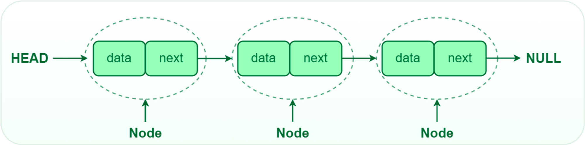

# 연결 리스트

---

### 정의
- 데이터의 순서가 메모리에 물리적인 순서대로 저장되지 않는다. 연속성을 보장하기 위해서 다음 데이터의 주소를 가지고 있다.
- 탐색에는 O(n)의 시간복잡도를 가진다.
- 시작 또는 끝 지점에 아이템을 추가하거나 삭제, 추출하는 작업에서 시간 복잡도 O(1)을 가진다.

### 시간 복잡도

Array의 경우 중간에 데이터를 삽입/삭제하게 되면 해당 인덱스의 뒤에 있는 모든 원소들은 shift를 해야만 했습니다. 그러다 보니 $O(n)$의 시간복잡도를 갖게 되었습니다. 하지만 Linked list를 물리적으로 옮길 필요없이 next address가 가리키는 주소값만 변경하면 되기 때문에 $O(1)$의 시간복잡도로 삽입/삭제가 가능합니다.

|  | Linked list |
| --- | --- |
| access | $O(n)$ |
| search | $O(n)$ |
| insertion | $O(1)$ |
| deletion | $O(1)$ |

### Dynamic Array를 Linked list와 비교하여 장단점을 설명해 주세요.

**[핵심 답변]**

Linked List와 비교했을 때, Dynamic Array의 장점은

- 데이터 접근과 할당이 $O(1)$로 굉장히 빠릅니다. 이는 index 접근하는 방법이 산술적인 연산 [배열 첫 data의 주소값] + [offset]으로 이루어져 있기 때문입니다. (randam access)
- Dynamic Array의 맨 뒤에 데이터를 추가하거나 삭제하는 것이 상대적으로 빠릅니다.($O(1)$)

Linked List와 비교했을 때, Dynamic Array의 단점은

- Dynamic Array의 맨 끝이 아닌 곳에 data를 insert or remove할 때, 느린 편입니다($O(n)$).  느린 이유는 메모리상에서 연속적으로 데이터들이 저장되어 있기 때문에, 데이터를 추가 삭제할 때 뒤에 있는 data들을 모두 한칸씩 shift 해야되기 때문입니다.
- resize를 해야할 때, 예상치 못하게 현저히 낮은 performance가 발생합니다.
- resize에 시간이 많이 걸리므로 필요한 것 이상 memory공간을 할당받습니다. 따라서 사용하지 않고 있는 낭비되는 메모리공간이 발생합니다.