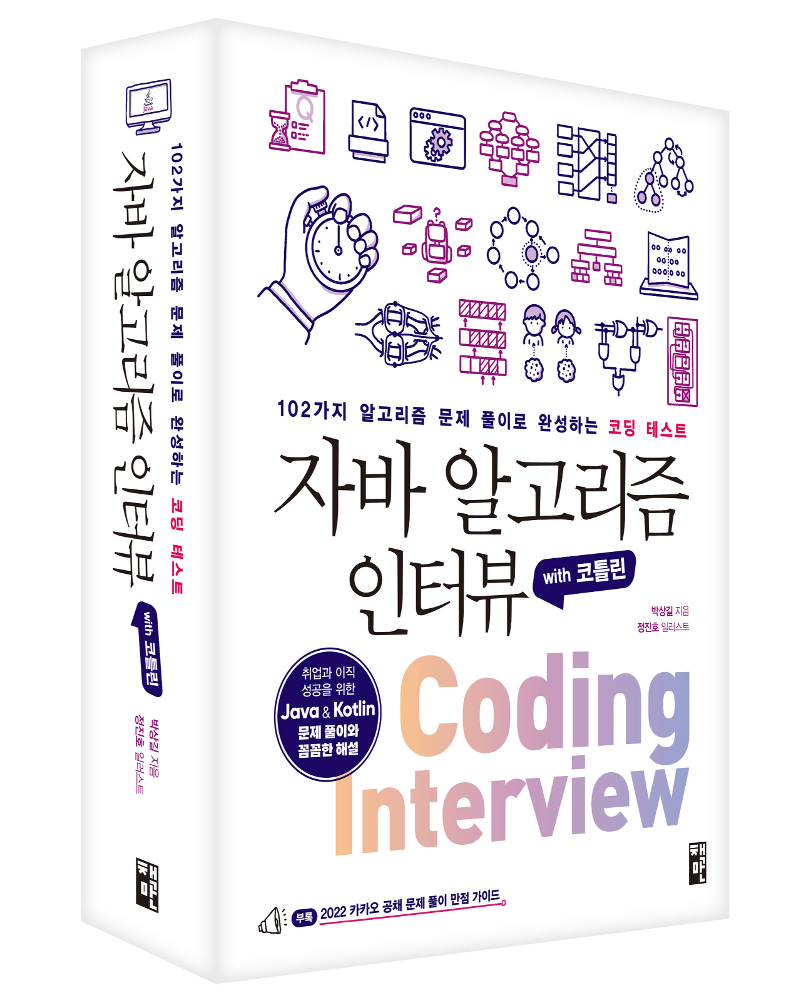

# 자바 알고리즘 인터뷰

- 

 

# 목차

- [3. 선형 자료구조](./3강/3.%20선형%20저료구조.md)
  - 배열, 연결 리스트, 스택, 큐, 데크, 우선순위 큐, 해시 테이블
- [4. 비선형 자료구조]()
  - 그래프, 최단 경로, 트리, 힙, 트라이
- [5. 알고리즘]()
  - 정렬, 이진 검색, 비트 조작, 슬라이딩 윈도우, 그리드, 분할, DP