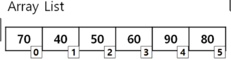

# 배열 (정적, 동적 )

---


### 정의
- 배열은 인접한 메모리 위치에 저장된 항목의 모음이다.
메모리에 연속적으로 저장하기 때문에 논리적, 물리적 연속성을 보장한다.


### Array의 특징

- 고정된 저장 공간(fixed-size)
- 순차적인 데이터 저장(order) -> 원소의 인덱스를 알면 0(1)으로 접근이 가능

Array의 장점은 lookup과 append가 빠르다는 것입니다. 따라서 조회를 자주 해야되는 작업에서는 Array 자료구조를 많이 씁니다.

Array의 단점은 fixed-size 특성상 선언시에 Array의 크기를 미리 정해야 된다는 것입니다. 이는 메모리 낭비나 추가적인 overhead가 발생할 수 있습니다.


### 시간 복잡도

|  | Array |
| --- | --- |
| access | $O(1)$ |
| append | $O(1)$ |
| 마지막 원소delete | $O(1)$ |
| insertion | $O(n)$ |
| deletion | $O(n)$ |
| search | $O(n)$ |


### 꼬리 질문

[ 문제 ] 
> 1. 미리 예상한 것보다 더 많은 수의 데이터를 저장하여 사이즈를 넘어서면 해결법
- 기존의 사이즈보다 더 큰 array를 선언하여 옮기고 기존의 array는 삭제한다.
    - 사이즈를 예측하기 어렵다면 linked list를 사용하여 데이터를 추가할 때 메모리 공간을 할당받는 방식으로 사용한다.


> 2. 스택, 큐
- 스택은 연결 리스트, 큐는 배열로 구현한다.


## 동적 배열 (Dynamic Array)

---



### 정의

- 동적 배열은 동적으로 크기의 조절이 가능한 배열 기반의 자료구조
  - 요소들을 순서적으로 저장하는데 사용한다.

### 특징

> 정적 배열과 동적 배열의 차이 ( 초기 메모리보다 크면 리사이징으로 동적으로 메모리 할당 )
- 정적 배열은 고정된 크기만큼 연속된 메모리 할당이다.
- 동적 배열은 초기에 메모리 할당하고 추가적으로 리사이징을 통하여 동적으로 메모리 크기를 변경할 수 있다는 차이가 있다.

> 동적 배열 원리
> 1. 미리 초기값을 작게 잡아 배열을 생성 ( 자바에서는 default capacity가 10으로 설정)
> 2. 배열이 꽉 채워지면 늘려주고 복사하는 방식 ( 대개는 더블링을 통해 2배씩 늘려준다.)
> 3. 자바에서 더블링은 2배가 아닌 그로스 팩터 즉. 성장 인자를 통해 늘려준다. 비율은 1.5배

```sql
int newCapacity = oldCapacity + (oldCapacity >>1));
```


### 시간 복잡도

| 연산 | 시간 복잡도 | 설명 |
| --- | --- | --- |
| Access (접근) | O(1) | 인덱스를 통해 요소에 직접 접근 가능 |
| Search (검색) | O(n) | 배열을 순회하여 요소를 검색 |
| Insert (삽입) | O(n) (평균) | 요소를 삽입할 위치 이후의 요소를 이동 |
|  | O(1) (리스트 끝에 추가 시) | 리스트의 끝에 요소를 추가하는 경우 O(1) |
| Deletion (삭제) | O(n) (평균) | 요소를 삭제할 위치 이후의 요소를 이동 |
|  | O(1) (리스트 끝에서 삭제 시) | 리스트의 끝에 있는 요소를 삭제하는 경우 O(1) |
| 크기 조절 (Resize) | O(n) (평균) | 크기를 조절하기 위해 모든 요소를 복사하고 새로운 배열을 할당 |


### Dynamic Array를 Linked list와 비교하여 장단점을 설명해 주세요.

**[핵심 답변]**

Linked List와 비교했을 때, Dynamic Array의 장점은

- 데이터 접근과 할당이 $O(1)$로 굉장히 빠릅니다. 이는 index 접근하는 방법이 산술적인 연산 [배열 첫 data의 주소값] + [offset]으로 이루어져 있기 때문입니다. (randam access)
- Dynamic Array의 맨 뒤에 데이터를 추가하거나 삭제하는 것이 상대적으로 빠릅니다.($O(1)$)

Linked List와 비교했을 때, Dynamic Array의 단점은

- Dynamic Array의 맨 끝이 아닌 곳에 data를 insert or remove할 때, 느린 편입니다($O(n)$).  느린 이유는 메모리상에서 연속적으로 데이터들이 저장되어 있기 때문에, 데이터를 추가 삭제할 때 뒤에 있는 data들을 모두 한칸씩 shift 해야되기 때문입니다.
- resize를 해야할 때, 예상치 못하게 현저히 낮은 performance가 발생합니다.
- resize에 시간이 많이 걸리므로 필요한 것 이상 memory공간을 할당받습니다. 따라서 사용하지 않고 있는 낭비되는 메모리공간이 발생합니다.