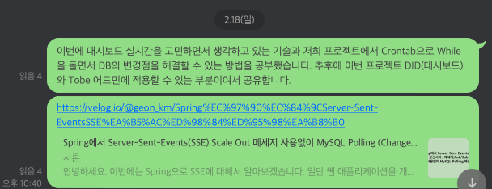

# 함께 성장하고 싶은 패키지

---

### 0126 / [다중 서버 환경에서 세션 불일치](https://velog.io/@geon_km/%EB%8B%A4%EC%A4%91-%EC%84%9C%EB%B2%84-%ED%99%98%EA%B2%BD%EC%97%90%EC%84%9C-%EC%84%B8%EC%85%98-%EB%B6%88%EC%9D%BC%EC%B9%98) 

- 기존의 단일 서버에서 다중 서버로 변경하면서 세션을 was로 관리하여 생기는 동기화 문제에 대해서 작성

---

### 0218 /[Spring에서 Server-Sent-Events(SSE) Scale Out 메세지 사용없이 MySQL Polling (Change Data Capture) 해결](https://velog.io/@geon_km/Spring%EC%97%90%EC%84%9CServer-Sent-EventsSSE%EA%B5%AC%ED%98%84%ED%95%98%EA%B8%B0)

---

### 0317 / [무중단 배포](https://velog.io/@geon_km/Nginx-%EB%AC%B4%EC%A4%91%EB%8B%A8-%EB%B0%B0%ED%8F%AC)

###  0519 [JUnit5, AssertJ 활용방법 및 Spring boot 테스트 코드 작성법](https://velog.io/@geon_km/%EB%8B%A8%EC%9C%84-%ED%85%8C%EC%8A%A4%ED%8A%B8-rs6ri4fz)
